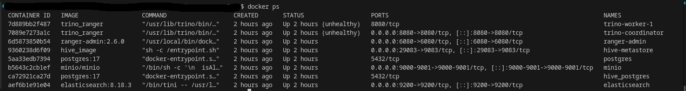
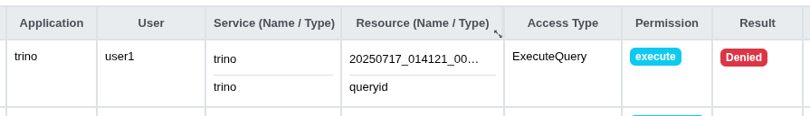
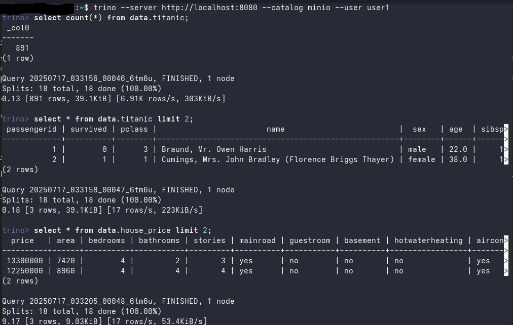
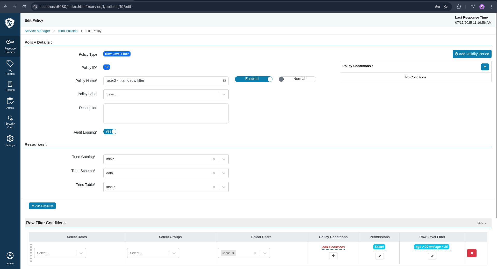

# User Akses Kontrol (MinIO, Trino, dan Apache Ranger)

## Prasyarat

- Docker
- Docker Compose

## MinIO

[MinIO](https://min.io/) adalah sistem penyimpanan objek open-source yang kompatibel dengan Amazon S3 API. MinIO digunakan untuk menyimpan data tidak terstruktur seperti gambar, video, log, backup, dan file lainnya dalam skala besar.

#### Konfigurasi MinIO

Untuk konfigurasi Minio anda dapat melihat detailnya di [Docker Compose](docker-compose.yml#L106) pada bagian `services` -> `minio`.

Ada beberapa konfigurasi yang anda dapat ubah di dalam file `docker-compose.yml`

- **Environment**

    ```yaml
    environment:
      - MINIO_ROOT_USER=admin
      - MINIO_ROOT_PASSWORD=admin123
      - MINIO_DOMAIN=minio
    ```

    Anda dapat mengubah environment pada bagian `environment` seperti berikut:

    - `MINIO_ROOT_USER`: Username untuk akses MinIO (default: `admin`)
    - `MINIO_ROOT_PASSWORD`: Password untuk akses MinIO (default: `admin123`)
    - `MINIO_DOMAIN`: Domain MinIO (default: `minio`)

&NewLine;
- **Ports Expose**

    ```yaml
    ports:
      - "9001:9001"
      - "9000:9000"
    ```

    - `9000`: Port untuk akses MinIO API (default: `9000`)
    - `9001`: Port untuk akses MinIO GUI (default: `9001`)

    Anda bisa mengubah ports expose (posisi sebelah kiri dari `:`) sesuai kebutuhan anda.
    
&NewLine;
- **Entrypoint**

    ```yaml
    entrypoint: >
      /bin/sh -c '
        isAlive() { curl -sf http://minio:9000/minio/health/live; }
        minio $0 "$@" --quiet & echo $! > /tmp/minio.pid
        until isAlive; do sleep 1; done
        echo "MinIO is ready. Proceeding with setup..."
        mc alias set myminio http://minio:9000 admin admin123
        mc mb myminio/data/ --ignore-existing
        mc anonymous set public myminio/data
        mc admin accesskey create myminio admin --access-key admin_minio --secret-key admin_minio
        kill -s INT $(cat /tmp/minio.pid) && rm /tmp/minio.pid
        while isAlive; do sleep 0.1; done
        exec minio $0 "$@"
      '
    ```

    Pada bagian entrypoint diatas kita menjalankan sebuah shell script untuk menjalankan `MinIO Client Command Line`, perintah tersebut bisa kita gunakan untuk menjalankan perintah-perintah seperti membuat bucket, membuat access key dan secret key, dan lain sebagainya. Dalam hal ini kita akan menggunakannya untuk membuat sebuah bucket dan Access Key/Secret Key yang akan digunakan oleh Trino untuk mengakses objek di dalam MinIO.
    
    &NewLine;
    Anda dapat mengubah entrypoint sesuai kebutuhan anda pada bagian berikut:

    - **Alias**
        ```yaml
        # mc alias set [alias_name] http://[minio-hostname]:9000 [username] [password]
        mc alias set myminio http://minio:9000 admin admin123
        ```

        Jika anda ingin menggunakan alias yang lain, anda dapat mengubah alias tersebut sesuai kebutuhan anda. Dalam hal ini saya menggunakan alias `myminio`.
        
        - [alias_name]: Nama alias yang akan digunakan (default: `myminio`)
        - [minio-hostname]: Hostname MinIO (default: `minio`)
        - [username]: Username untuk akses MinIO (default: `admin`)
        - [password]: Password untuk akses MinIO (default: `admin123`)

    - **Bucket**
        ```yaml
        # mc mb [alias_name]/[bucket_name] --ignore-existing
        mc mb myminio/data/ --ignore-existing
        ```

        Jika anda ingin menggunakan nama bucket yang lain, anda dapat mengubah nama bucket tersebut sesuai kebutuhan anda degan format `[alias_name]/[bucket_name]`. Dalam hal ini saya menggunakan bucket `myminio/data`.
        
        - [alias_name]: Nama alias yang akan digunakan (default: `myminio`)
        - [bucket_name]: Nama bucket yang akan dibuat (default: `data`)
    
    - **AWS Credentials (Access Key/Secret Key)**
        ```yaml
        # mc admin accesskey create [alias_name] [username] --access-key [access_key] --secret-key [secret_key]
        mc admin accesskey create myminio admin --access-key admin_minio --secret-key admin_minio
        ```

        Jika anda ingin menggunakan username yang lain, anda dapat mengubah username tersebut sesuai kebutuhan anda. Dalam hal ini saya menggunakan username `admin`. Lalu untuk Access Key dan Secret Key saya menggunakan `admin_minio`.
        
        - [alias_name]: Nama alias yang akan digunakan (default: `myminio`)
        - [username]: Username yang akan digunakan untuk membuat Access Key/Secret Key (default: `admin`)
        - [access_key]: Access Key yang akan dibuat (default: `admin_minio`)
        - [secret_key]: Secret Key yang akan dibuat (default: `admin_minio`)

## Trino

[Trino](https://trino.io/) (sebelumnya bernama [PrestoSQL](https://prestodb.io/)) adalah query engine open-source yang digunakan untuk menjalankan SQL query secara cepat di data besar (big data), tanpa perlu memindahkan data.

#### Konfigurasi Trino

Untuk konfigurasi Trino anda dapat melihat detailnya di [Docker Compose](docker-compose.yml#L136) pada bagian `services` -> `trino-coordinator` dan `services` -> `trino-worker-1`

Pada konfigurasi trino kali ini, kita akan menggunakan **Docker Compose Extension Field** (contoh: `x-trino-common`) dikarenakan agar tidak melakukan penulisan konfigurasi yang berulang, sebab konfigurasi untuk `trino-coordinator` dan `trino-worker-1` sebagian besar sama.

- **Docker Compose Extension Field**
    ```yaml
    x-trino-common:
  &trino-common
  build:
    context: ./trino
    dockerfile: Dockerfile
    args:
      - TRINO_VERSION=476
      - JARS_DIRECTORY=/usr/lib/trino/plugin/hive
      - HADOOP_AWS_JAR_VERSION=3.3.4
      - MINIO_JAR_VERSION=8.5.17
      - AWS_BUNDLE_JAR_VERSION=1.12.782
  image: local/trino_ranger:476
  networks:
    - ranger-net
  environment:
    &trino-env
    TRINO_DISCOVERY_URI: http://trino-coordinator:8080
    ```

    Sebagian besar konfigurasi untuk trino dilakukan di dalam `x-trino-common`. Anda dapat mengubah konfigurasi tersebut sesuai kebutuhan anda.

    - **TRINO_VERSION**: Versi Trino yang akan digunakan (default: `476`)
    - **JARS_DIRECTORY**: Directory untuk menyimpan plugin Hive yang akan digunakan oleh Trino untuk membuat katalog dari MinIO (default: `/usr/lib/trino/plugin/hive`)
    - **HADOOP_AWS_JAR_VERSION**: Versi jar Hadoop AWS yang akan digunakan oleh Trino (default: `3.3.4`)
    - **MINIO_JAR_VERSION**: Versi jar MinIO yang akan digunakan oleh Trino (default: `8.5.17`)
    - **AWS_BUNDLE_JAR_VERSION**: Versi jar AWS Bundle yang akan digunakan oleh Trino (default: `1.12.782`)

    &NewLine;
    Untuk `&trino-common` dan `&trino-env` disebut sebagai Anchor. Anchor mendefinisikan suatu blok konfigurasi yang bisa dipakai ulang di tempat lain

&NewLine;
- **Trino Coordinator**

    Trino Coordinator adalah node utama dalam Trino cluster yang bertugas sebagai master yang mengatur dan mengkoordinasi semua node Trino worker dalam cluster. Konfigurasi untuk `trino-coordinator` adalah sebagai berikut:

    ```yaml
    trino-coordinator:
    <<: *trino-common
    container_name: trino-coordinator
    ports:
      - "8080:8080"
    environment:
      TRINO_DISCOVERY_URI: http://trino-coordinator:8080
      TRINO_NODE_ID: coordinator
    volumes:
      - ./trino/coordinator-config:/etc/trino
    depends_on:
      - ranger
    ```

    Di dalam konfigurasi tersebut ada sebuah blok `<<: *trino-common`. Blok ini disebut sebagai Alias, yang digunakan untuk memanggil Anchor `&trino-common` untuk memanggil ulang isi yang sudah di-anchorkan sebelumnya.

    &NewLine;
    Lalu pada bagian `volumes` dilakukan mounting Folder lokal dari `./trino/coordinator-config` ke dalam container. Folder tersebut berisi konfigurasi untuk Trino Coordinator melakukan integrasi dengan MinIO dan Apache Ranger.

    &NewLine;
    Anda dapat mengubah konfigurasi trino coordinator pada beberapa file yang ada di dalam folder `./trino/coordinator-config`, antara lain:
    - `./trino/coordinator-config/config.properties`
        disini anda dapat mengubah konfigurasi untuk Trino Coordinator seperti berikut:
        - `coordinator`: Penanda apakah node ini adalah Trino Coordinator (default: `true`)
        - `node-scheduler.include-coordinator`: Menjalankan Trino Coordinator sebagai worker (default: `false`)
        - `http-server.http.port`: Port untuk Trino Coordinator (default: `8080`)
        - `discovery.uri`: URI untuk Trino Coordinator (default: `http://trino-coordinator:8080`)
        - `query.max-memory`: Maksimal memori yang digunakan oleh Trino Coordinator (default: `8GB`)
        - `query.max-memory-per-node`: Maksimal memori yang digunakan oleh setiap node Trino Coordinator (default: `4GB`)
    - `./trino/coordinator-config/jvm.config`
        disini anda dapat mengubah konfigurasi untuk JVM Trino Coordinator seperti berikut:
        - `-Xmx8G`: Maksimal memori yang digunakan oleh JVM Trino Coordinator (default: `8GB`)
        - `-XX:G1HeapRegionSize=32M`: Ukuran memori region untuk Garbage Collection G1 (default: `32MB`)
    - `./trino/coordinator-config/log.properties`
        disini anda dapat mengubah konfigurasi untuk log Trino Coordinator seperti berikut:
        - `log.level`: Level log yang akan digunakan oleh Trino Coordinator apakah `DEBUG`, `INFO`, `WARN`, `ERROR` (default: `INFO`)
    - `./trino/coordinator-config/node.properties`
        disini anda dapat mengubah konfigurasi untuk node Trino Coordinator seperti berikut:
        - `node.environment`: Environment node Trino Coordinator (default: `development`)
        - `node.id`: ID node Trino Coordinator (default: `coordinator`)
        - `node.data-dir`: Directory untuk menyimpan data node Trino Coordinator (default: `/data/trino`)

&NewLine;
- **Trino Worker 1**

    Trino Worker 1 adalah node yang bertugas sebagai worker yang menjalankan query di dalam Trino cluster. Konfigurasi untuk `trino-worker-1` adalah sebagai berikut:

    ```yaml
    trino-worker-1:
    <<: *trino-common
    container_name: trino-worker-1
    volumes:
      - ./trino/worker-config-1:/etc/trino
    environment:
      <<: *trino-env
      TRINO_NODE_ID: worker1
    depends_on:
      - trino-coordinator
    ```

    Pada bagian `volumes` dilakukan mounting folder lokal dari `./trino/worker-config-1` ke dalam container. Folder tersebut berisi konfigurasi untuk Trino Worker 1 melakukan integrasi dengan MinIO dan Apache Ranger.

    &NewLine;
    Anda dapat mengubah konfigurasi trino worker pada beberapa file yang ada di dalam folder `./trino/worker-config-1`, antara lain:
    - `./trino/worker-config-1/config.properties`
        disini anda dapat mengubah konfigurasi untuk Trino Worker 1 seperti berikut:
        - `coordinator`: Penanda apakah node ini adalah Trino Coordinator (default: `false`)
        - `http-server.http.port`: Port untuk Trino Worker 1 (default: `8080`)
        - `discovery.uri`: URI untuk Trino Worker 1 (default: `http://trino-coordinator:8080`)
        - `query.max-memory`: Maksimal memori yang digunakan oleh Trino Worker 1 (default: `8GB`)
        - `query.max-memory-per-node`: Maksimal memori yang digunakan oleh setiap node Trino Worker 1 (default: `4GB`)
    - `./trino/worker-config-1/jvm.config`
        disini anda dapat mengubah konfigurasi untuk JVM Trino Worker 1 seperti berikut:
        - `-Xmx8G`: Maksimal memori yang digunakan oleh JVM Trino Worker 1 (default: `8GB`)
        - `-XX:G1HeapRegionSize=32M`: Ukuran memori region untuk Garbage Collection G1 (default: `32MB`)
    - `./trino/worker-config-1/log.properties`
        disini anda dapat mengubah konfigurasi untuk log Trino Worker 1 seperti berikut:
        - `log.level`: Level log yang akan digunakan oleh Trino Worker 1 apakah `DEBUG`, `INFO`, `WARN`, `ERROR` (default: `INFO`)
    - `./trino/worker-config-1/node.properties`
        disini anda dapat mengubah konfigurasi untuk node Trino Worker 1 seperti berikut:
        - `node.environment`: Environment node Trino Worker 1 (default: `development`)
        - `node.id`: ID node Trino Worker 1 (default: `worker1`)
        - `node.data-dir`: Directory untuk menyimpan data node Trino Worker 1 (default: `/data/trino`)

&NewLine;
*__NOTE:__* 
Jika anda ingin menambahkan jumlah worker, anda dapat menduplikasikan konfigurasi **Trino Worker 1** di dalam file `docker-compose.yml` dan melakukan perubahan seperti berikut:
- Mengubah nama service menjadi `trino-worker-2`, `trino-worker-3`, dst.
- Mengubah `container_name` menjadi `trino-worker-2`, `trino-worker-3`, dst.
- Mengubah `TRINO_NODE_ID` menjadi `worker2`, `worker3`, dst.
- Mengubah `volumes` menjadi `./trino/worker-config-2`, `./trino/worker-config-3`, dst.
- Menduplikasikan folder `./trino/worker-config-1` menjadi `./trino/worker-config-2`, `./trino/worker-config-3`, dst.
- Mengubah value dari `node.id` menjadi `worker2`, `worker3`, dst. di file konfigurasi `node.properties`

## Integrasi Trino dengan MinIO

Untuk melakukan integrasi Trino dengan MinIO kita harus membuat sebuah file konfigurasi untuk katalog yang kemudian kita simpan di dalam folder `./trino/coordinator-config/catalog` dan `./trino/worker-config-1/catalog`. File konfigurasi tersebut kita beri nama `minio.properties` dan isi file tersebut seperti berikut:

```properties
connector.name=hive
hive.metastore.uri=thrift://hive-metastore:9083
hive.recursive-directories=true
hive.storage-format=PARQUET
fs.native-s3.enabled=true
s3.aws-access-key=admin_minio
s3.aws-secret-key=admin_minio
s3.endpoint=http://minio:9000
s3.region=us-east-1
s3.path-style-access=true
```

Anda dapat mengubah konfigurasi ini sesuai kebutuhan anda, seperti mengganti `s3.aws-access-key` dan `s3.aws-secret-key` dengan akun MinIO yang telah anda buat.

Harap perhatikan juga untuk konfigurasi Hive Metastore yang ada di [./hive/core-site.xml](./hive/core-site.xml#L4) sudah sesuai dengan konfigurasi MinIO yang telah anda buat.

## Apache Ranger

Apache Ranger adalah sistem manajemen keamanan data yang digunakan untuk mengatur kontrol akses (authorization) secara terpusat pada berbagai komponen big data seperti Hadoop, Hive, HBase, Kafka, Trino, dan lainnya.

#### Konfigurasi Apache Ranger

Untuk konfigurasi Apache Ranger anda dapat melihat detailnya di [Docker Compose](docker-compose.yml#L90) pada bagian `services` -> `ranger`

Untuk melakukan konfigurasi Apache Ranger anda dapat mengubah beberapa value yang ada dalam file `./ranger/config/install.properties` di [sini](./ranger/config/install.properties).

- **RANGER DB**

    ```properties
    #DB_FLAVOR=MYSQL|ORACLE|POSTGRES|MSSQL|SQLA
    DB_FLAVOR=postgres
    ```

    Anda dapat mengubah value pada bagian `DB_FLAVOR` sesuai kebutuhan anda. Untuk defaultnya adalah `postgres`.

    &NewLine;
    Dan juga sesuaikan konfigurasi pada bagian `SQL_CONNECTOR_JAR` seperti berikut:

    ```properties
    SQL_CONNECTOR_JAR=/root/postgresql.jar
    #SQL_CONNECTOR_JAR=/usr/share/java/ojdbc6.jar
    #SQL_CONNECTOR_JAR=/usr/share/java/mysql-connector-java.jar
    #SQL_CONNECTOR_JAR=/usr/share/java/sqljdbc4.jar
    #SQL_CONNECTOR_JAR=/opt/sqlanywhere17/java/sajdbc4.jar
    #SQL_CONNECTOR_JAR=/usr/share/java/mysql-connector-java.jar
    ```

    Anda dapat mengubah value pada bagian `SQL_CONNECTOR_JAR` sesuai kebutuhan anda. Untuk defaultnya adalah `/root/postgresql.jar` sesuai dengan yang ditentukan di dalam file [Dockerfile](./ranger/Dockerfile#L35) Apache Ranger.

    &NewLine;
    Untuk kredensial database pada bagian berikut:

    ```properties
    db_root_user=postgres
    db_root_password=postgres
    db_host=postgres
    ```

    Anda dapat mengubah value pada bagian `db_root_user`, `db_root_password`, dan `db_host` sesuai dengan konfigurasi database postgres yang telah dibuat di dalam [Docker Compose](docker-compose.yml#L40).

&NewLine;
- **RANGER ADMIN PASSWORD**

    ```properties
    rangerAdmin_password=Rangeradmin1
    rangerTagsync_password=Rangeradmin1
    rangerUsersync_password=Rangeradmin1
    keyadmin_password=Rangeradmin1
    ```

    Anda dapat mengubah value pada bagian `rangerAdmin_password`, `rangerTagsync_password`, `rangerUsersync_password`, dan `keyadmin_password` sesuai kebutuhan anda. Untuk defaultnya adalah `Rangeradmin1`

&NewLine;
- **SOURCE FOR AUDIT STORE**

    ```properties
    audit_store=elasticsearch
    ```

    Anda dapat mengubah value pada bagian `audit_store` sesuai kebutuhan anda. Untuk defaultnya adalah `elasticsearch`.

    &NewLine;
    Karena dalam hal ini kita menggunakan `elasticsearch` sebagai source untuk audit store. Maka kita lakukan konfigurasi untuk Host Elasticsearchnya seperti ini:

    ```properties
    audit_elasticsearch_urls=elasticsearch
    audit_elasticsearch_port=9200
    audit_elasticsearch_protocol=http
    audit_elasticsearch_user=elastic
    audit_elasticsearch_password=elasticsearch
    audit_elasticsearch_index=ranger_audits
    audit_elasticsearch_bootstrap_enabled=true
    ```

    Disesuaikan dengan konfigurasi Elasticsearch yang ada di `docker-compose.yml` di bagian `services` -> `elasticsearch`

## Integrasi Apache Ranger dengan Trino

Sekarang kita akan melakukan integrasi antara Apache Ranger dan Trino. Untuk melakukan integrasi tersebut kita akan melakukan konfigurasi pada Trino Coordinator dan Trino Worker. Adapun file konfigurasi untuk Trino Coordinator dan Trino Worker tersebut ialah adalah `access-control.properties`, `ranger-policymgr-ssl.xml`, `ranger-trino-audit.xml`, dan `ranger-trino-security.xml` yang dapat berada di folder `./trino/coordinator-config` dan `./trino/worker-config-1`.

- **access-control.properties**

    &NewLine;
    File ini digunakan oleh Trino untuk menentukan class Java mana yang akan digunakan sebagai Access Control Manager. Untuk melakukan konfigurasi pada file ini anda dapat mengubah beberapa value yang ada di dalamnya, seperti berikut:

    - `access-control.name`: Harus diisi dengan `ranger`
        ```properties
        access-control.name=ranger
        ```

    - `ranger.service.name`: Diisi dengan nama service yang dibuat di Ranger Admin. Misalnya `trino`
        ```properties
        ranger.service.name=trino
        ```
    
    - `ranger.plugin.config.resource`: Lokasi file konfigurasi Ranger plugin berada. dipisahkan dengan menggunakan koma (,)
        ```properties
        ranger.plugin.config.resource=/etc/trino/ranger-trino-audit.xml,/etc/trino/ranger-trino-security.xml,/etc/trino/ranger-policymgr-ssl.xml
        ```

- **ranger-policymgr-ssl.xml**

    &NewLine;
    File konfigurasi ini digunakan untuk mengatur koneksi secure (SSL) antara plugin Ranger di Trino dengan Ranger Admin (Policy Manager Server).

    Anda bisa membiarkan file konfigurasi ini secara default. Karna di repositori ini kita tidak menggunakan SSL. Kalau anda menggunakan SSL, maka anda dapat mengubah konfigurasi ini sesuai kebutuhan anda.

&NewLine;
- **ranger-trino-audit.xml**

    &NewLine;
    File ini mengatur audit logging untuk plugin Trino di Ranger. Dalam hal ini kita menggunakan `elasticsearch` sebagai source untuk audit store. 
    
    &NewLine;
    Untuk melakukan konfigurasi Apache Ranger anda dapat mengubah beberapa value yang ada di dalam file `ranger-trino-audit.xml`. Anda dapat menyesuaikan dengan konfigurasi Elasticsearch yang ada di `docker-compose.yml` di bagian `services` -> `elasticsearch`

&NewLine;
- **ranger-trino-security.xml**

    &NewLine;
    File utama konfigurasi Ranger plugin di Trino. Di file ini kita akan mengisi URL dari Ranger Admin Service untuk sinkronisasi policy dan nama service yang ada pada Ranger Admin. Kita bisa mengubah nilai pada tag xml berikut:

    ```xml
    <property>
    <name>ranger.plugin.trino.policy.rest.url</name>
    <value>http://ranger-admin:6080</value>
    <description>MANDATORY: a comma separated list of URLs to Apache Ranger instances in a deployment</description>
  </property>

  <property>
    <name>ranger.plugin.trino.access.cluster.name</name>
    <value>trino</value>
    <description>Name to identify the cluster running the Trino instance. This is recorded in audit logs generated by the plugin</description>
  </property>
    ```

    Untuk properti yang lain bisa kita biarkan secara default.

&NewLine;
Di atas kita melihat bahwa beberapa konfigurasi diharuskan memasukkan nama service trino yang ada di Ranger Admin, dalam hal ini kita mengisi dengan value `trino`. Lalu darimana kita bisa mengetahui nama service tersebut?

Kita bisa mengetahuinya dengan melihat file [trino_service_setup.py](./ranger/config/trino_service_setup.py). Disitu script python bertugas untuk membuat service di Ranger Admin dengan menggunakan library `apache_ranger`. Script python tersebut akan membuat sebuah service dengan konten dari file json `./ranger/config/trino-service.json` yang sekaligus membuat user dengan username `ranger-admin`. Kemudian script python tersebut akan dijalankan oleh `docker-entrypoint.sh` Apache Ranger sesaat setelah Ranger Admin dijalankan.

## Deployment

1. Cloning Repositori

    ```bash
    $ git clone https://github.com/verdandi/trino_ranger_minio.git
    ```

2. Deploy docker-compose

    ```bash
    $ cd trino_ranger_minio
    $ docker-compose up -d
    ```

    Setelah itu kita bisa melihat apakah docker container berhasil berjalan atau tidak dengan menggunakan perintah `docker ps`

    

3. Konfirmasi Services

    Untuk konfirmasi bahwa semua services telah berhasil berjalan, anda dapat mengunjungi URLs berikut:

    - Ranger Admin: http://localhost:6080
    - MinIO: http://localhost:9001
    - Trino: http://localhost:8080

## Membuat akses kontrol untuk Trino di Apache Ranger Admin

Sebelum kita membuat akses kontrol untuk Trino di Ranger Admin, terlebih dahulu kita menyiapkan sebuah data dummy yang akan kita upload ke dalam MinIO. Saya sudah siapkan dummy data dalam bentuk file parquet di folder `./data-sample/`. 

1. Login ke MinIO UI dengan menggunakan username dan password yang sudah dibuat sebelumnya, yaitu `admin` dan `admin123`.


2. Kemudian kita buat sebuah folder dengan nama `sample` di dalam bucket `data` dengan menekan tombol `Create new path` di sebelah kanan.


3. Kemudian kita upload file `titanic.parquet` ke dalam folder `sample` dengan menekan tombol `Upload` di sebelah kanan.

4. Lakukan juga langkah sebelumnya untuk file `house-price.parquet`, tetapi dengan nama folder `sample2`


4. Kemudian kita akan mengakses catalog MinIO di Trino dengan menggunakan Trino Command Line Interface. Anda dapat menginstal Trino CLI dengan mengunjungi dokumentasinya di [https://trino.io/docs/current/cli.html](https://trino.io/docs/current/cli.html). Dan jalankan perintah berikut:

    ```bash
    $ trino --server http://localhost:8080 --catalog minio --user ranger-admin
    ```

5. Kemudian kita akan membuat sebuah schema di dalam Trino dengan menjalankan query berikut:

    ```sql
    CREATE SCHEMA minio.data
    WITH (
      location = 's3a://data/'
    );
    ```
6. Lalu kita akan membuat sebuah table berdasarkan file `titanic.parquet` dan file `house-price.parquet` yang berada di dalam MinIO dengan menjalankan query berikut:

    - Untuk file `titanic.parquet`:
      ```sql
      CREATE TABLE minio.data.titanic (
          PassengerId bigint,
          Survived integer,
          Pclass integer,
          Name varchar,
          Sex varchar,
          Age double,
          SibSp integer,
          Parch integer,
          Ticket varchar,
          Fare double,
          Cabin varchar,
          Embarked varchar
      )
      WITH (
          external_location = 's3a://data/sample',
          format = 'PARQUET'
      );
      ```
    - Untuk file `house-price.parquet`:
      ```sql
      CREATE TABLE minio.data.house_price (
          price BIGINT,
          area BIGINT,
          bedrooms INTEGER,
          bathrooms INTEGER,
          stories INTEGER,
          mainroad VARCHAR,
          guestroom VARCHAR,
          basement VARCHAR,
          hotwaterheating VARCHAR,
          airconditioning VARCHAR,
          parking INTEGER,
          prefarea VARCHAR,
          furnishingstatus VARCHAR
      )
      WITH (
          external_location = 's3a://data/sample2',
          format = 'PARQUET'
      );
      ```

7. Kita pastikan apakah table tersebut berhasil dibuat dengan menjalankan query berikut:

    ```sql
    SELECT * FROM minio.data.titanic LIMIT 10;
    SELECT * FROM minio.data.house_price LIMIT 10;
    ```

&NewLine;
Setelah kita selesai menyiapkan data dummy, kita akan lanjut membuat akses kontrol untuk Trino di Apache Ranger Admin. Saya akan menjelaskan step by step untuk membuat akses kontrol untuk Trino di Apache Ranger Admin.

#### Login ke Apache Ranger Admin UI

Kita akan login ke Apache Ranger Admin UI dengan menggunakan username `admin` dan password yang sudah dibuat sebelumnya, `Rangeradmin1`.


Untuk memastikan apakah Trino berhasil terhubung ke Ranger Admin, anda dapat melihatnya di menu `Audits` -> `Plugins`. Disana akan terlihat status `Policies synced to plugin` yang menunjukkan bahwa Trino berhasil terhubung ke Ranger Admin.


#### Create normal user from Ranger Admin UI
Lanjut kita akan membuat user baru di menu `Settings` -> `Users` kemudian `Add New User`. Saat membuat user baru, kita dapat memilih roles apa yang akan digunakan, yaitu:

- `user` role sebagai user biasa
- `Admin` role sebagai admin yang bisa membuat dan mengatur akses kontrol dari Ranger Admin UI.
- `Auditor` role sebagai auditor yang mendapatkan akses hanya `read-only`.

Kita akan coba membuat user dengan username `user1` dan memakai role `user`


*Note: Untuk form `password` silahkan diisi saja. Untuk sekarang akses ke trino masih tidak menggunakan password. Penggunaan password bisa dilakukan jika trino sudah menggunakan TLS/SSL*

#### Konfirmasi akses untuk `user1` yang baru dibuat

Kita lihat dibawah ini bahwa user `ranger-admin` dapat mengakses semua table yang berada di skema `minio.data` di Trino.


Lalu kita coba mengakses semua table `minio.data` dengan `user1` yang baru kita buat.


Seperti yang kita lihat disini terdapat error `Access Denied` karena user `user1` belum memiliki akses policy. Agar kita bisa tahu dibagian mana yang ditolak oleh Trino, kita bisa melihat di menu `Audits` -> `Access`. 


Terlihat bahwa `user1` belum memiliki akses terhadap `Impersonate` ke resource `trinouser`. Hal ini dikarenakan Trino secara default tidak menjalankan query sebagai user Ranger, melainkan sebagai user sistem. Tanpa konfigurasi impersonation, policy di Ranger tidak akan cocok dengan user sebenarnya yang menjalankan query dari sisi Trino.

Untuk mengatasi hal ini, kita bisa ke menu `Resources Policies` -> `trino` agar dapat membuat policy untuk mengatur akses `Impersonate` ke user `user1` atau menambahkan `user1` ke dalam policy yang mengatur akses `Impersonate` yang sudah ada. Karena dalam hal ini policy tersebut sudah ada kita tinggal menambahkan `user1` ke dalam policy yang bernama `all - trinouser`.


Dan jika belum ada kita bisa membuat policy baru dengan cara `Add New Policy` dan konfigurasi seperti gambar di bawah ini:


Lalu kita coba lagi mengakses table `minio.data.titanic` dengan `user1` yang baru kita buat.


Kita tetap mendapatkan error. Tetapi kali ini errornya tidak seperti sebelumnya, kita bisa lihat kembali di menu `Audits` -> `Access` untuk error kali ini.



Kali ini error yang terjadi karena `user1` belum memiliki akses `ExecuteQuery` ke resource `queryid` sehingga tidak bisa menjalankan query sebagai user Ranger. Untuk mengatasi hal ini, kita akan lakukan kembali cara yang sama seperti sebelumnya.


Kita coba lagi apakah kita bisa mengakses semua table dari skema `minio.data` dengan `user1`.


Kita tetap mendapatkan error. Tetapi kali ini kita hanya tinggal membuat policy untuk mengakses datanya saja. 

Kali ini kita akan membuat policy untuk mengakses semua table dari skema `minio.data`. Kita akan coba membuat policy baru untuk akses ke skema `minio.data`


Kita juga bisa memberi akses yang spesifik izin di setiap policy, tapi untuk sekarang kita akan membuat policy dengan semua izin. Setelah kita selesai membuat policy, kita akan melihat policy yang kita buat sudah muncul di halaman depan.


Kita konfirmasikan lagi aksesnya.


Saat ini kita masih mendapatkan error, tetapi kali ini errornya tidak seperti sebelumnya, kita bisa lihat kembali di menu `Audits` -> `Access` untuk error kali ini.


Dari informasi yang ada di halaman audit kita sudah bisa mengakses katalog, tetapi kita masih tidak diizinkan untuk mengakses catalognya karna tidak dapat izin dari `information_schema` yang dimana menyimpan metadata tentang table dan table column yang ada didalam katalog. Untuk mengatasi hal ini kita bisa menambahkan policy seperti berikut. Disini user yang kita masukkan adalah {USER} varibale di Ranger yang akan memberikan akses `information_schema` ke semua user.


Disini kita hanya akan memberikan izin `read-only` ke `information_schema` untuk semua user.

Kita coba lagi apakah kita bisa mengakses semua table dari skema `minio.data` dengan `user1`.


Sekarang kita sudah berhasil mengakses semua table dari skema `minio.data` dengan `user1`. Kita bisa melihat bahwa di halaman audit sudah tidak ada error lagi.


kita juga sudah bisa melihat data dari table yang ada di dalam skema `minio.data` dengan `user1`



## Memberi limitasi akses ke user Ranger

Kita bisa memberi limitasi akses ke salah satu atau beberapa user Ranger dengan membuat izin spesifik pada sebuah policy. Kita akan coba memberi limitasi akses ke user baru yaitu `user2`, anda bisa membuat user baru dengan cara yang sama seperti [sebelumnya](#create-normal-user-from-ranger-admin-ui).

Lalu kita edit policy `all - trinouser` dan `all - queryid` yang sebelumnya hanya spesifik untuk `user1` saja menjadi `{USER}` variable agar dapat diakses oleh semua user Ranger.


Kita akan coba memberi limitasi akses ke user baru yaitu `user2` agar hanya bisa mengakses table `minio.data.titanic` saja.


Lalu kita konfirmasikan dengan menjalankan query `show tables` untuk melihat berhasil atau tidak.


Bisa kita lihat table yang muncul hanya table `titanic` saja.

Kemudian kita akan coba lebih spesifik lagi agar hanya bisa melihat beberapa kolom saja, misalnya hanya kolom `passengerid`, `name`, dan `age` saja. Kita bisa edit policy sebelumnya menjadi seperti berikut:


Kita konfirmasikan untuk melihat berhasil atau tidak.


Bisa kita lihat saat menjalankan query `select * from minio.data.titanic` muncul error `Access Denied` karena hanya bisa mengakses beberapa kolom saja. Kita bisa lihat saat menjalankan query `show columns from minio.data.titanic` hanya muncul kolom yang dipilih dan juga saat menjalankan query `select passengerid, name, age from minio.data.titanic` query berhasil dijalankan.


#### Masking data

Kita juga bisa memberi masking data atau enkripsi data ke user Ranger. Kita akan coba limitasi ke user `user2` dengan mengenkripsikan kolom `name`.

Untuk melakukan masking kita akan membuat policy pada tab `Masking` di menu `Resources Policies` -> `trino` seperti berikut:


Kita bisa memilih tipe masking yang ingin dipakai, misalkan disini menggunakan `Redact` untuk tipe maskingnya.

Kita konfirmasikan untuk melihat berhasil atau tidak.


Value dari kolom `name` akan terenkripsi seperti di atas.

#### Row Level Filter

Untuk melakukan row level filter kita akan membuat policy pada tab `Row Level Filter` di menu `Resources Policies` -> `trino` seperti berikut:



Perbedaan disini adalah kita menggunakan query untuk melakukan row level filter bukan dengan pilihan. Sebagai contoh kita akan membuat filter yang hanya akan memunculkan data dengan nilai kolom `age` di atas 20 dan dibawah 25 dengan query `age > 20 and age < 25`.

Berbeda dengan hasil sebelumnya, kita bisa lihat bahwa hanya data dengan nilai kolom `age` di atas 20 dan dibawah 25 yang muncul.

